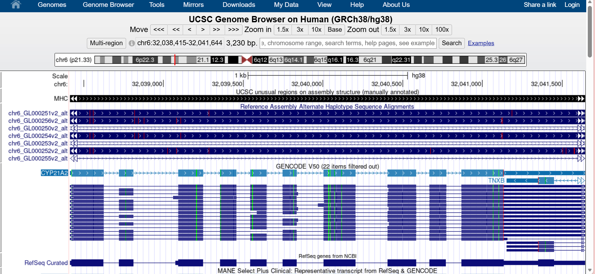
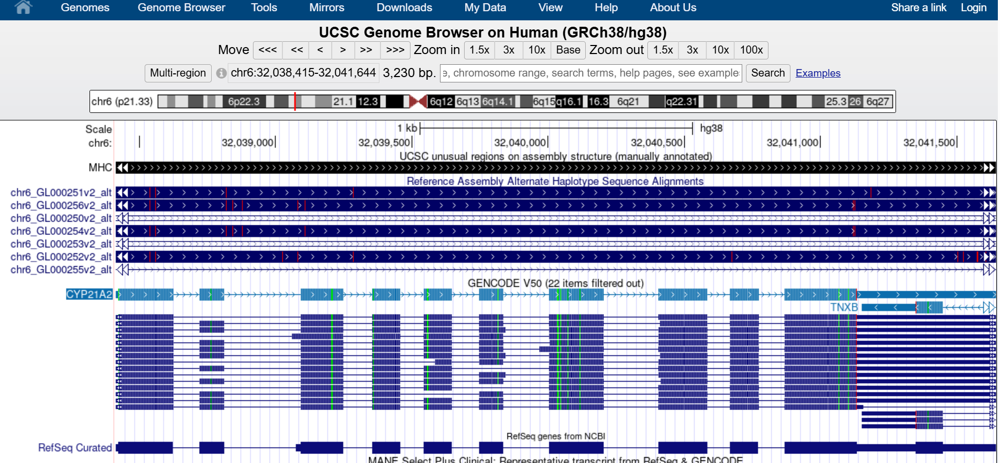
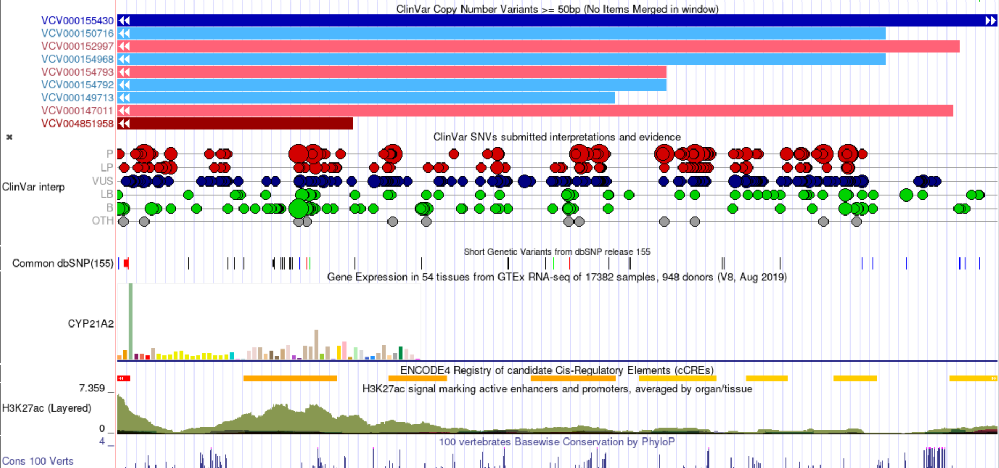
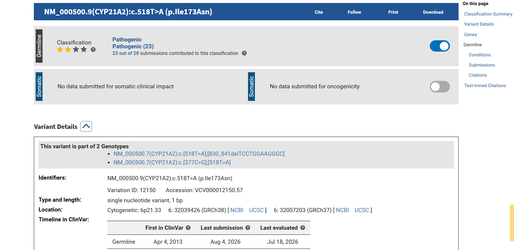
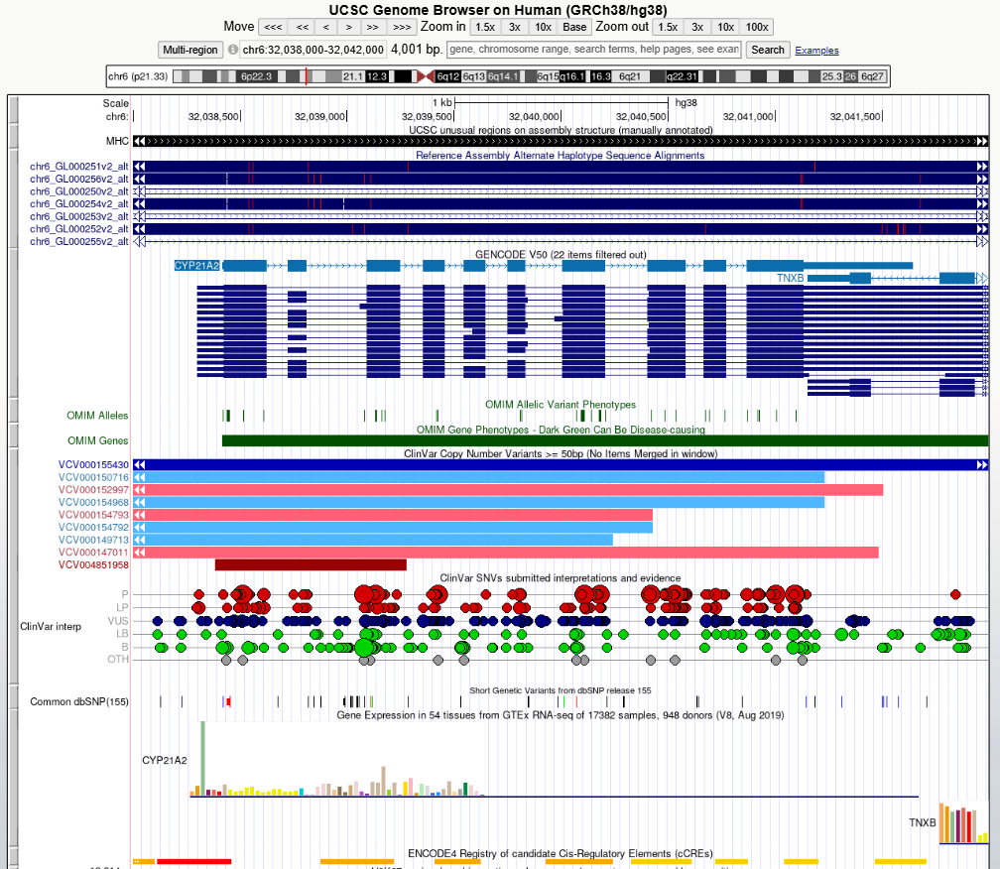

# Exploring a Human Disease Gene Using UCSC Genome Browser and NCBI ClinVar

**Name:** Niña Karylle A. Catipay

**Assigned Gene:** CYP21A2

**Associated Disease:** Congenital Adrenal Hyperplasia (CAH) due to 21-hydroxylase deficiency  

## Bioinformatics Lab Activity

This activity investigates the CYP21A2 gene using the UCSC Genome Browser and NCBI ClinVar.

## 2. UCSC Gene Location

The CYP21A2 gene was located using the UCSC Genome Browser with the human GRCh38/hg38 assembly[cite: 2].

- **Official gene symbol:** CYP21A2
- **Full gene name:** Cytochrome P450 Family 21 Subfamily A Member 2
- **Chromosome:** 6
- **Genome assembly:** GRCh38/hg38[cite: 2]
- **Genomic coordinates:** chr6:32,038,000–32,042,000[cite: 2]
- **DNA strand:** +
- **Approximate gene size:** ~3,400 bp

### Screenshot 1 – CYP21A2 Gene Location

## 3. Exons, Introns, and Transcripts

**Selected transcript:** NM_000500.9 (MANE Select)

- **Number of exons:** 10
- **Multiple transcripts/isoforms visible:** Yes. Multiple transcript models and pseudogene alignments (CYP21A1P) are visible in the GENCODE and RefSeq tracks.
- **Exons:** Exons are represented by the blue boxes in the gene model.
- **Introns:** Introns are represented by the lines connecting the exon boxes.
- **Relative length:** Introns and exons are relatively short in CYP21A2 compared to other human genes, with several exons and introns being comparable in size.

### Screenshot 2 – CYP21A2 Gene Structure

## 4. Annotation and Conservation

**a. Which gene annotation track did you use?**  
I used the GENCODE V50 and RefSeq Curated annotation tracks to examine the CYP21A2 gene structure.

**b. Were ClinVar-related variant marks visible within or near your gene?**  
Yes. Multiple ClinVar-related variant marks were visible across the CYP21A2 gene region, including ClinVar Short Nucleotide Variants and ClinVar submitted interpretations.

**c. Were some regions more conserved than others?**  
Yes. The conservation track showed that exonic regions and key enzymatic domains had stronger conservation signals than intronic regions.

**d. Did conserved regions correspond mainly to exons, introns, both, or another region?**  
The stronger conservation signals appeared mainly around exonic regions, reflecting the functional importance of the coding sequence for enzyme function.

**e. Why can strong conservation suggest biological importance?**  
Strong conservation indicates that a sequence has been preserved across evolutionary history because alterations often disrupt critical protein structures or regulatory mechanisms.

### Screenshot 3 – Genome Browser Tracks

## 5. ClinVar Variant Record

**a. Gene:** CYP21A2

**b. Variant name/HGVS description:** NM_000500.9(CYP21A2):c.518T>A (p.Ile173Asn)

**c. rsID or ClinVar Variation ID/VCV accession:** Variation ID 12150; VCV000012150

**d. Chromosome and genomic position:** Chromosome 6: 32039800 (GRCh38)

**e. Associated condition/disease:** Congenital Adrenal Hyperplasia due to 21-hydroxylase deficiency

**f. Clinical significance:** Pathogenic

**g. Review status:** Reviewed by expert panel / Multiple submitters

**h. ClinVar record URL:** https://www.ncbi.nlm.nih.gov/clinvar/variation/12150/

### Screenshot 4 – ClinVar Variant Record

## 6. Locating and Interpreting the Variant in UCSC

**Selected variant:** NM_000500.9(CYP21A2):c.518T>A (p.Ile173Asn)

**Genomic position:** chr6:32,038,000–32,042,000 region (GRCh38)[cite: 2]

### Part F Questions

**a. Where is the variant located relative to your gene?**  
The variant is located within Exon 4 of the CYP21A2 gene.

**b. Is it in an exon, intron, UTR, splice region, or another region?**  
The variant is located directly within a coding exon (Exon 4).

**c. Is it likely in a coding or non-coding region based on the displayed annotations?**  
It is in a coding region because it alters nucleotide 518, resulting in a missense amino acid change from Isoleucine to Asparagine at codon 173 (p.Ile173Asn).

**d. Based on its location and ClinVar information, briefly explain how the variant might affect the gene or gene product.**  
Because the variant alters a conserved amino acid within an essential coding exon, it impairs 21-hydroxylase enzyme activity. ClinVar classifies this variant as **Pathogenic**, causing simple virilizing Congenital Adrenal Hyperplasia.

**e. What additional evidence would be needed before concluding that the variant causes disease?**  
Because this variant is well-established as Pathogenic, existing evidence already includes functional enzymatic assays, patient cohort co-segregation analysis, and extensive clinical consensus.

### Screenshot 5 – Selected Variant in UCSC

## 7. Interpretation

The selected CYP21A2 variant, c.518T>A (p.Ile173Asn), is a coding missense mutation located in Exon 4. The nucleotide substitution alters the translated protein sequence, reducing enzymatic efficiency of steroid 21-hydroxylase. ClinVar classifies this variant as **Pathogenic**, and its location directly within an essential exon aligns with its established role in causing Congenital Adrenal Hyperplasia.

## 8. Part G – Short Reflection

### 1. What did UCSC show you about your gene that was not obvious from simply reading about the gene's function?
UCSC clearly highlighted the close proximity and structural similarity between CYP21A2 and its pseudogene (CYP21A1P), which explains why gene conversion events and misalignments occur in this genomic locus.

### 2. Why is knowing the exact genomic location of a disease-associated variant useful?
Knowing the exact coordinate determines whether a mutation affects a coding exon, splice site, or non-coding regulatory element, directly informing predictions about protein disruption.

### 3. What is one limitation of predicting a variant's effect only from its genomic location?
Location alone cannot reveal the precise degree of functional impairment or variable clinical expressivity without empirical clinical and biochemical evidence.

### 4. What was the most interesting feature you observed about your assigned gene?
Seeing the exact mapping of pathogenic ClinVar markers directly underneath the coding exons in UCSC made the connection between clinical phenotype and genomic architecture immediately clear.

## 9. References and Links

### UCSC Genome Browser
- [CYP21A2 Gene & Variant Location – UCSC Genome Browser](https://genome.ucsc.edu/)

### NCBI ClinVar
- [VCV000012150 – ClinVar – NCBI](https://www.ncbi.nlm.nih.gov/clinvar/variation/12150/)
